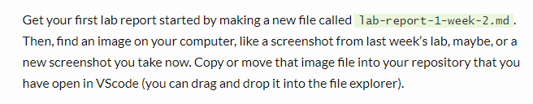
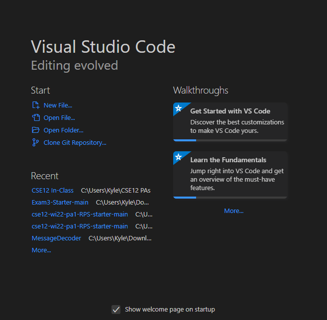
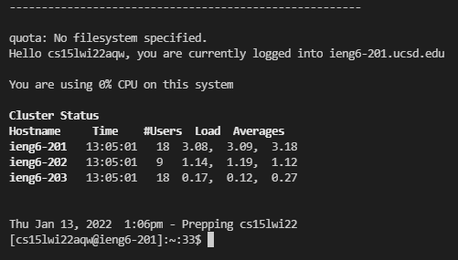
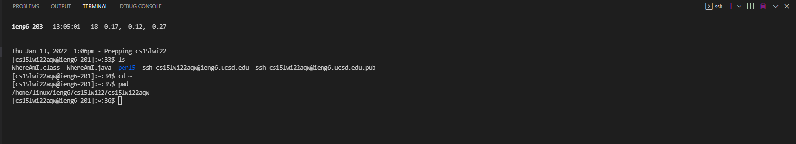
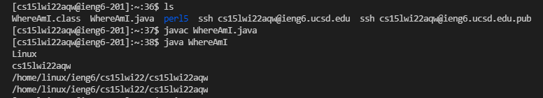
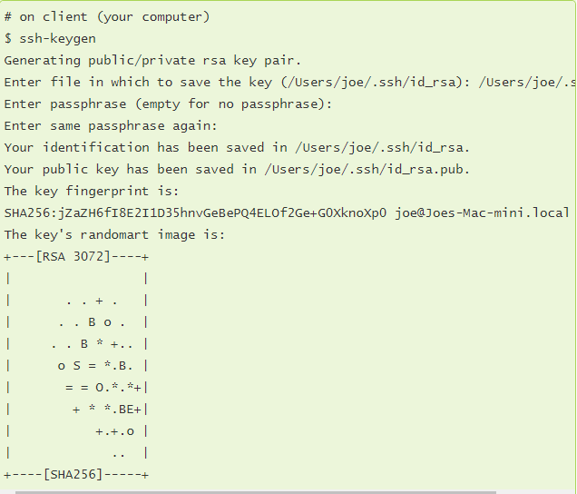
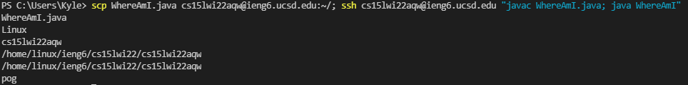

> Lab Activity

This is an image below:



[Link to main page](https://kyledvu.github.io/cse15l-lab-reports/lab-report-1-week-2.html)

# Remote Access Login Guide
This guide will demonstrate how to log on to the `ieng6` server with your specific UCSD course account.
___

**1. Installing VSCode**

Simply navigate to [this site](https://code.visualstudio.com/) to download VSCode. Make sure that you download the correct version depending on the operating system you have. The home page will look something like this:

___

**2. Remotely Connecting**

 Open up VSCode's terminal (Terminal &#8594; New Terminal in the top left). Then, using the digits associated with your [account information](https://sdacs.ucsd.edu/~icc/index.php), run the following command:
 ```
 $ ssh cs15lwi22zz@ieng6.ucsd.edu
 ```
 Remember to replace the `zz` in the command with your own digits. 
 
 Once you log in with your password, you may be prompted with a few questions; if this is your first time logging in, you should just answer yes to all of them. When you have successfully connected, you should see a screen similar to this:
 
 ___

 **3. Trying Some Commands**

To make sure everything is working properly, try running some basic commands such as `ls`, `cd ~`, or `pwd`. `ls` will list the files in the current directory, `cd ~` will change the directory to the home directory, and `pwd` will display the path to the current directory. Here are some examples of running these commands below:

___

**4. Moving Files with `scp`**

The `scp` command is capable of copying multiple files from your local client to a remote one or vice versa. In the example below, I am using this command to copy a file called `WhereAmI.java` from my local host to the `ieng6` server.
```
$ scp WhereAmI.java cs15lwi22zz@ieng6.ucsd.edu:~/
```
Try running this command and then using `ssh` to log back into the remote server. Then, use the `ls` command to see if your file has successfully appeared there. It might look something like this:

___

**5. Setting an SSH Key** 

By creating an SSH key, you can avoid the need to type in your password every time you login, while still keeping your account and connection secure. 
\
\
From your **local** client, run the `ssh-keygen` command. This will generate a public and private key. By having the private key somewhere in your local client, and the public key in the remote server, it acts in place of a "password". It will look something like this: 

\
\
Now, log back into the remote server with `ssh`. We will now copy the public key onto the remote server (the private key should already be in your local client). First, we will create a directory called `.shh` on the remote sever. Next, log out and from your local client, copy the public key to the directory you just created. This set of steps should look like this:
```
$ ssh cs15lwi22zz@ieng6.ucsd.edu
<Enter Password>
# now on server
$ mkdir .ssh
$ <logout>
# back on client
$ scp /Users/joe/.ssh/id_rsa.pub cs15lwi22@ieng6.ucsd.edu:~/.ssh/authorized_keys
# You use your username and the path you saw in the command above
```
___

**6. Optimizing Remote Running**

Making local edits to your files, copying them to the remote server, and then running them can be a tedious process. Luckily, there are ways you can speed up/simplify this process. For example, you can put a command in quotes at the end of an `ssh` command to run it on the remote server and then exit. You can also use semicolons in-between commands to run them on the same line. Combining the two, you could write a line in the terminal like this:


Here, I am copying my file onto the remote server, logging in, and running the file in one line. From here, I can simply use the up arrow in my terminal to rerun this command whenever I need to. You can use similar ideas to make remote running as smooth and efficient as possible. 
