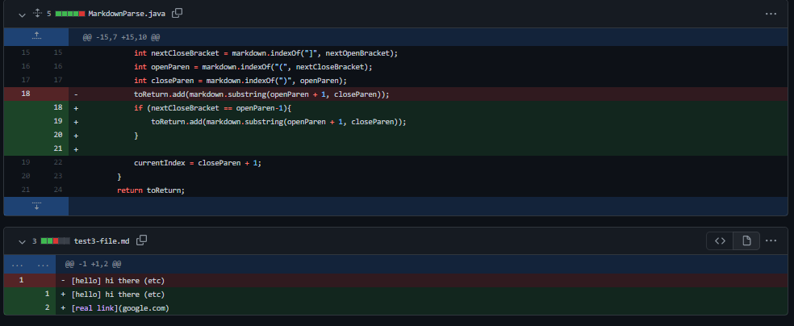
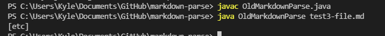

# Week 4 Lab Report (code changes and bug fixes)

**1. First code change**

I deleted my old `test3-file.md` to stay consistent with the rest of my lab group, but [here](https://github.com/kyledvu/markdown-parse/commit/74d205ad28a6354f3e39c53c621cd1787eb2b47f) is the original test file that prompted me to make changes to my code. 

When this file was run at the command line before it was fixed, the output looked like this (here I am running the code with the original `MarkdownParse.java`):

Here, we can see the program incorrectly output [etc], even though etc was not a link, just some text in parentheses. This is because the program did not account for the fact that a link must have its open parenthesis directly following a closed bracket. When I tried to run `MarkdownParse` with `test3-file.md`, it caused the program to fail.

**2. Second code change**