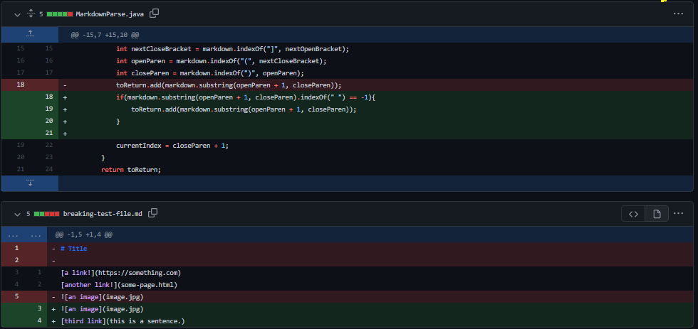
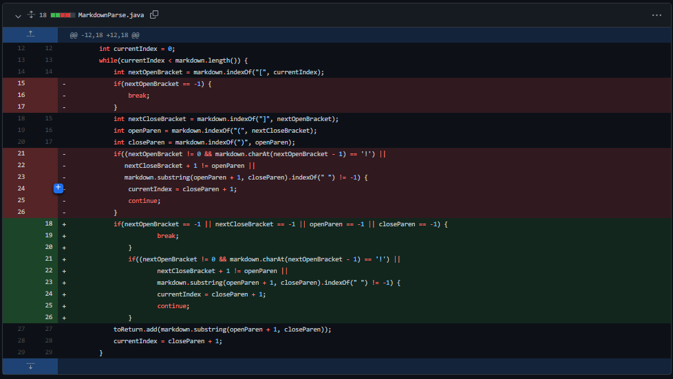

# Week 4 Lab Report (code changes and bug fixes)

**1. First code change**

I deleted my old `test3-file.md` to stay consistent with the rest of my lab group, but [here](https://github.com/kyledvu/markdown-parse/commit/74d205ad28a6354f3e39c53c621cd1787eb2b47f) is the original test file that prompted me to make changes to my code. 

When this file was run at the command line before it was fixed, the output looked like this (here I am running the code with the original `MarkdownParse.java`):

Here, we can see the program incorrectly output [etc], even though etc was not a link, just some text in parentheses. This is because the program did not account for the fact that a link must have its open parenthesis directly following a closed bracket. When I tried to run `MarkdownParse` with `test3-file.md`, it caused the program to fail.

**2. Second code change**

[Here](https://github.com/njaurigue/markdown-parse/blob/f38efc57d4dbb8ca742d82a08cf5901b03b93c7f/breaking-test-file.md) is the test file we used during lab that prompted us to make changes to the code.

When this file was run before we fixed the code, the output looked like this: 

The program output had "this is a sentence." as a link even though it had spaces within the parentheses (and therefore is not a link). Our program was not checking whether or not the text inside parentheses following brackets had spaces in it. Therefore, when we tried to run `MarkdownParse` with `breaking-test-file.md`, the program did not produce the correct output.

**3. Third code change**

[Here](https://github.com/kyledvu/markdown-parse/blob/d0551e32bc18afaadf2e366762f145604281a323/test-file3.md) is the test file we used during lab that prompted us to make changes to the code.

When this file was run before we made fixes, the output looked like this: 

The program was not visibly outputting anything. This is because our program had a bug where it was getting stuck in an infinite loop, since there were no parentheses in the test file. This is why when we tried to run `MarkdownParse` with `test-file3.md`, the program did not produce the correct output.