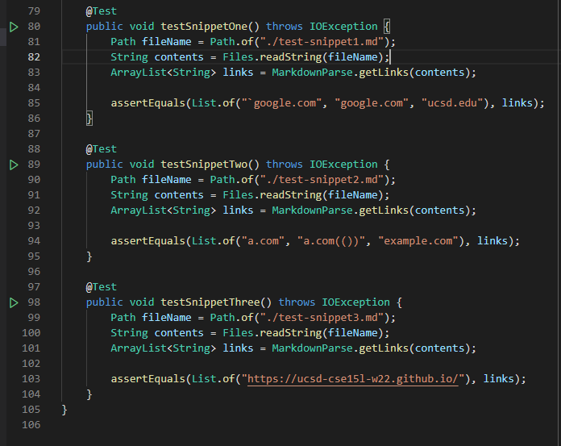
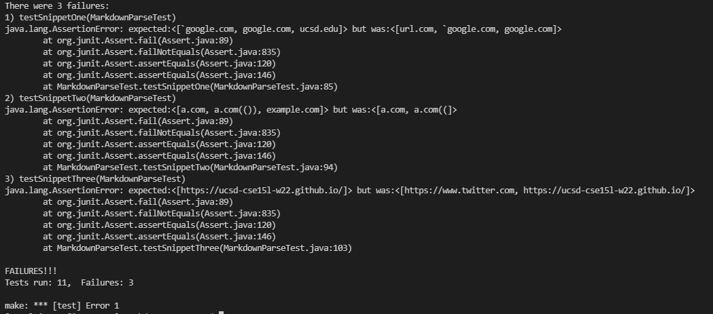
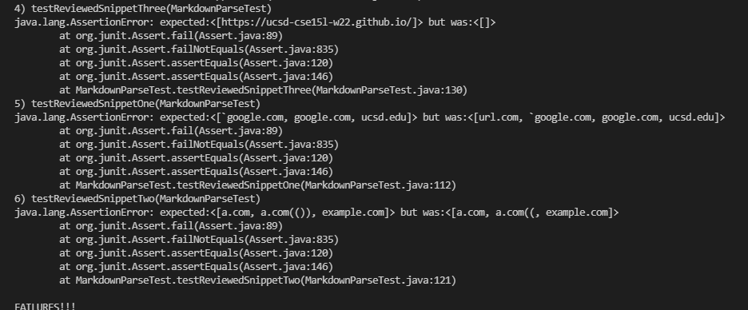

# Week 8 Lab Report (debugging MarkdownParse)

[my MarkdownParse repo](https://github.com/kyledvu/markdown-parse)

[reviewed MarkdownParse repo](https://github.com/ocboogie/markdown-parse)

To test the three provided snippets, I created a new md file for each and added
three new tests to my `MarkdownParseTest.java` file, like so:

To determine the correct output for each test, I went by what [the CommonMark demo site](https://spec.commonmark.org/dingus/) considered a link and what it didn't. 

For my implementation of `MarkdownParse`, I got the following output when running the tests:

For the implementation of `MarkdownParse` I reviewed, I got this output:

Neither my implementation nor the one I reviewed passed any of the tests for the new snippets.

1. Fixes for first test snippet

I think there is a relatively small fix to account for backticks. `MarkdownParse` would have to check for two backticks on the same line, and then ignore any potential links within these ticks. It would work in a similar way to how the code already checks for brackets, although slightly more complicated.

2. Fixes for second test snippet

I feel like the fix for `MarkdownParse` to work for the second test snippet would be a bit more involved. The program would need to be able to keep track of "pairs" of brackets/parentheses, e.g which open bracket corresponds to which closed bracket. It would also need to be able to check for escaped characters. I think these two fixes together would likely take more than 10 lines.

3. Fixes for third test snippet

I think the only fix my code needs to fix the third test case would be to check for newline characters in the link title. This should be a relatively short fix.