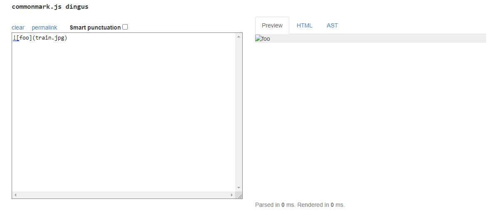
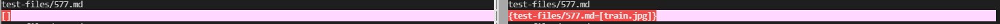
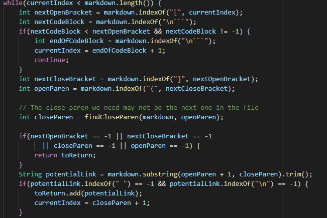
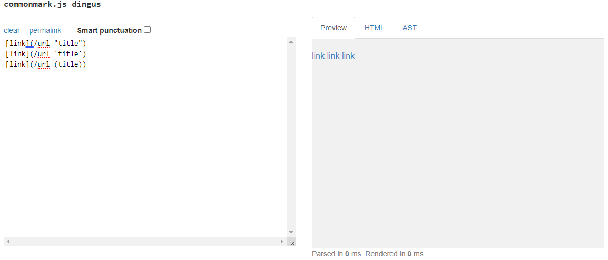
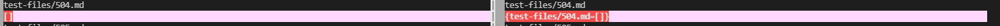

# Week 10 Lab Report (more MarkdownParse debugging)

In order to find differences in the output of my MarkdownParse's implementation versus Week 9's provided implementation, I used `diff`. Here are two examples these differences.

1. **First difference/bug (Test 577.md)**

The actual contents of the file as well as its expected outcome based on the CommonMark site are as follows:

The results of my MarkdownParse (the output on the left) and the provided MarkdownParse (the output on the right) are below:

For this test, I believe my implementation is correct and the provided is wrong. This test file contains an image, which is not a link. Week 9's MarkdownParse implementation is not differentiating between images and links. To fix the provided implementation, a simple check for a "!" before the open bracket of a potential link should fix the issue. This check should come before we add `potentialLink` to `toReturn`.

2. **Second difference/bug (Test 504.md)**

The actual contents of the file as well as its expected outcome based on the CommonMark site are as follows:

The results of my MarkdownParse (the output on the left) and the provided MarkdownParse (the output on the right) are below:

For this test, I believe both my implementation and the provided one do not produce the expected result. The CommonMark site considers there to be three links in the file, but each of our implementations returns zero links. 

Currently, both programs consider any potential links with spaces in the parenthesis to be not a link. However, according to the CommonMark site, quotations, single quotations, and parentheses themselves within the parenthesis allow there to be spaces and still be considered a valid link.

To fix this issue in Week 9's implementation, we could add a check for quotations, single quotations, and parentheses inside `potentialLink`. Then, if there are spaces within the potential link but also these special characters, we would still consider `potentialLink` to be valid. Again, we would just add this check before adding `potentialLink` to `toReturn` in the while loop.

